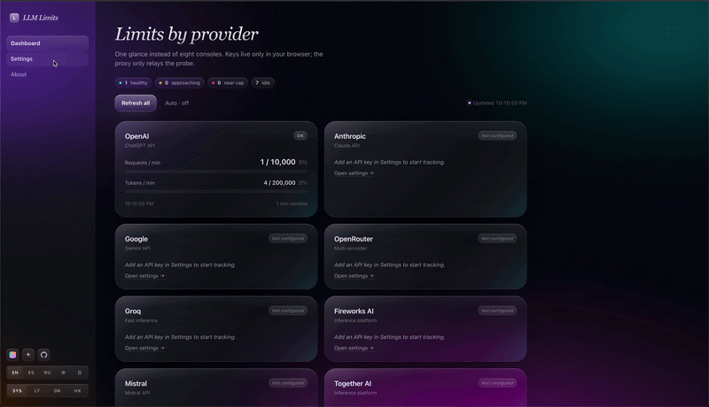
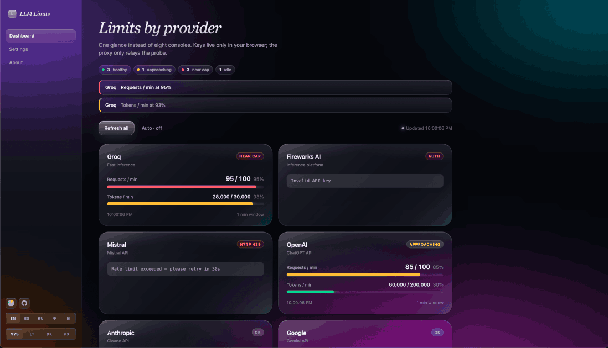
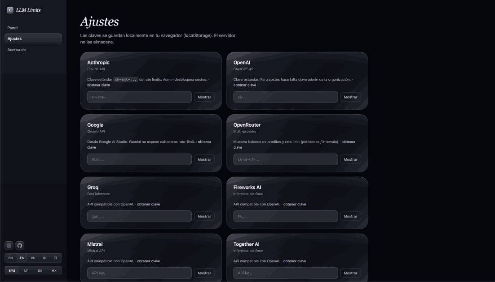
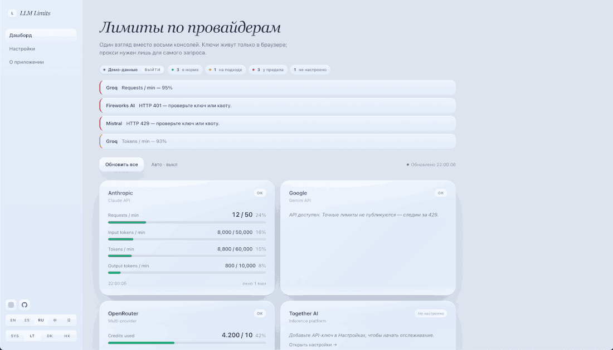
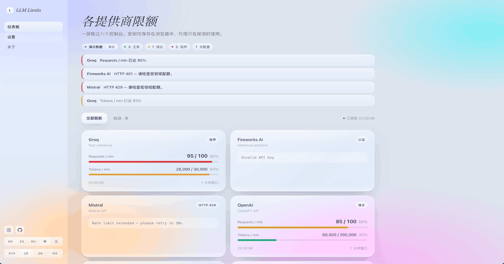
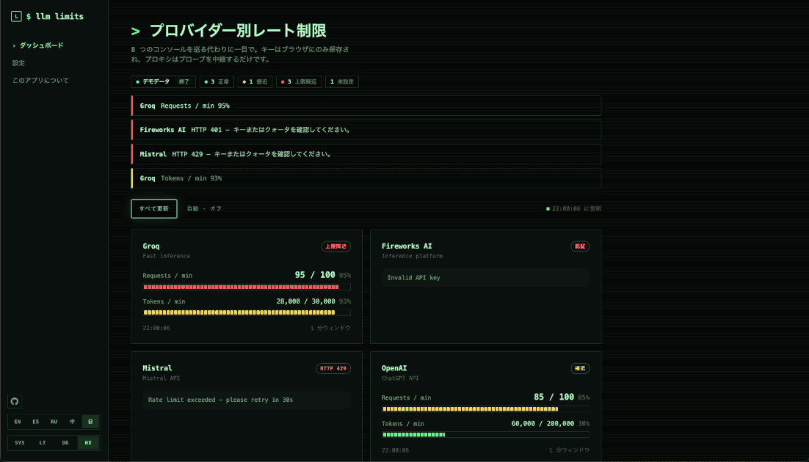

<div align="center">

# LLM Limits Tracker

**Local dashboard for LLM API rate limits — across Claude, GPT, Gemini, OpenRouter, Groq, Fireworks, Mistral and Together.**

Stop opening eight different consoles. Run one command, see every quota in one screen.

[](https://www.npmjs.com/package/llm-limits-tracker)
[](https://www.npmjs.com/package/llm-limits-tracker)
[](LICENSE)




</div>

---

## Why this exists

If you build with multiple LLMs, you already know the routine: production hits a 429, you alt-tab to one console, then another, then a third, trying to figure out which provider is the bottleneck. The big observability platforms (Helicone, Langfuse, LiteLLM) solve this for teams — but they're heavy, require code instrumentation, or live in someone else's cloud.

**LLM Limits Tracker is the opposite of that.** One file, no dependencies, no signup, your keys never leave your machine. Think of it as `glances` for LLM APIs.

## Features

- **8 providers out of the box** — Anthropic, OpenAI, Google Gemini, OpenRouter, Groq, Fireworks, Mistral, Together
- **Real rate-limit data** — read straight from the providers' response headers (RPM, TPM, input/output tokens)
- **Threshold alerts** — warning at 80%, critical at 95% (configurable)
- **Auto-refresh** — optional 60-second polling
- **Auto-save settings** — paste a key and it's saved + probed on the spot, no Save button
- **Three themes** — Apple Glass (light & dark) and a green-on-black Hacker mode
- **Five languages** — English, Русский, Español, 中文, 日本語
- **Local-only by default** — server binds to `127.0.0.1`; keys live in browser `localStorage`
- **Zero dependencies** — pure Node.js, no `npm install`, single binary you can read in 5 minutes

## Themes

<table>
<tr>
<td></td>
<td></td>
<td></td>
</tr>
<tr>
<td align="center"><sub><b>Glass Light</b> · warm cream, refined</sub></td>
<td align="center"><sub><b>Glass Dark</b> · warm dark, restrained</sub></td>
<td align="center"><sub><b>Hacker</b> · CRT terminal, ASCII bars</sub></td>
</tr>
</table>

<details>
<summary>More views</summary>

<table>
<tr>
<td></td>
<td></td>
</tr>
<tr>
<td align="center"><sub>Settings</sub></td>
<td align="center"><sub>First-run empty state</sub></td>
</tr>
</table>

</details>

## Quickstart

```bash
git clone https://github.com/KovalevAnton/llm-limits-tracker
cd llm-limits-tracker
node server.js
```

Open http://localhost:5173 and paste any provider's API key into **Settings** — the dashboard probes it immediately, no Save button, no Refresh.

Or via npm:

```bash
npx llm-limits-tracker
```

To expose it on your LAN (e.g. for a TV dashboard), set `HOST=0.0.0.0`. The default `127.0.0.1` binding matches the local-only threat model in [SECURITY.md](SECURITY.md).

## What you get per provider

| Provider     | Metrics                                   | Source                               |
|--------------|--------------------------------------------|---------------------------------------|
| Anthropic    | RPM, input TPM, output TPM, total TPM      | `anthropic-ratelimit-*` headers       |
| OpenAI       | RPM, TPM                                   | `x-ratelimit-*` headers               |
| OpenRouter   | Credit balance, RPM (interval-based)       | `/api/v1/auth/key` JSON               |
| Groq         | RPM, TPM                                   | `x-ratelimit-*` headers               |
| Fireworks AI | RPM, TPM                                   | `x-ratelimit-*` headers               |
| Mistral      | RPM, TPM                                   | `x-ratelimit-*` headers               |
| Together AI  | RPM, TPM                                   | `x-ratelimit-*` headers               |
| Gemini       | API status (200 / 429 / auth)              | response status (no rate-limit headers) |

## What it does NOT show

Subscription limits for **Claude Pro/Max, ChatGPT Plus/Pro, and Gemini Advanced** are not exposed via API — they're closed UI metrics inside the chat products. This tool tracks limits for your **API account**. A browser-extension companion that scrapes the chat UIs is on the roadmap.

## How it works

```
┌──────────┐   localhost:5173   ┌───────────┐   HTTPS   ┌────────────────┐
│ Browser  │ ◀────────────────▶ │ server.js │ ◀───────▶ │ Provider APIs  │
│ (UI +    │                    │ (proxy +  │           │ (Anthropic,    │
│  state)  │                    │  static)  │           │  OpenAI, ...)  │
└──────────┘                    └───────────┘           └────────────────┘
```

The proxy exists for one reason: browsers block direct calls to provider APIs (CORS). The proxy forwards them and pipes the response — including rate-limit headers — back to the UI, which parses and renders.

API keys are stored only in your browser's `localStorage` and travel to the proxy via a single `X-Provider-Key` header per request. Nothing is persisted on disk by the server.

## Roadmap

- [ ] Browser extension for chat-subscription limits (Claude Pro/Max, ChatGPT Plus, Gemini Advanced)
- [ ] Slack / Discord webhook alerts at threshold crossings
- [ ] Persistent history (SQLite) and 7-day usage graphs
- [ ] Per-project tagging — log which app burned which quota
- [ ] More providers — Cohere, Replicate, Perplexity, DeepInfra, Anyscale
- [ ] CLI mode (`llm-limits status` for terminal use)
- [ ] Docker image for self-hosted setups

See `CONTRIBUTING.md` for "good first issues".

## Where to get API keys

- **Anthropic** — <https://console.anthropic.com/settings/keys>
- **OpenAI** — <https://platform.openai.com/api-keys>
- **Google Gemini** — <https://aistudio.google.com/app/apikey>
- **OpenRouter** — <https://openrouter.ai/keys>
- **Groq** — <https://console.groq.com/keys>
- **Fireworks** — <https://fireworks.ai/account/api-keys>
- **Mistral** — <https://console.mistral.ai/api-keys/>
- **Together** — <https://api.together.xyz/settings/api-keys>

## Project layout

```
llm-limits-tracker/
├── server.js              # Proxy + static server, zero deps (~210 lines)
├── public/
│   ├── index.html         # Markup only (~115 lines)
│   ├── styles.css         # Three themes, no preprocessor
│   └── app.js             # i18n, providers, parsers, render — vanilla JS
├── docs/                  # Internal notes, launch material (not published to npm)
├── package.json
├── LICENSE                # MIT
├── CHANGELOG.md
├── SECURITY.md
├── CONTRIBUTING.md
└── README.md
```

## Contributing

PRs welcome. The codebase is intentionally small — three short files in `public/` and one in `server.js`, no build step — so contribution friction stays low. See [CONTRIBUTING.md](CONTRIBUTING.md) for development setup and ideas for first contributions.

## License

MIT — do whatever you want, no warranty. See [LICENSE](LICENSE).
